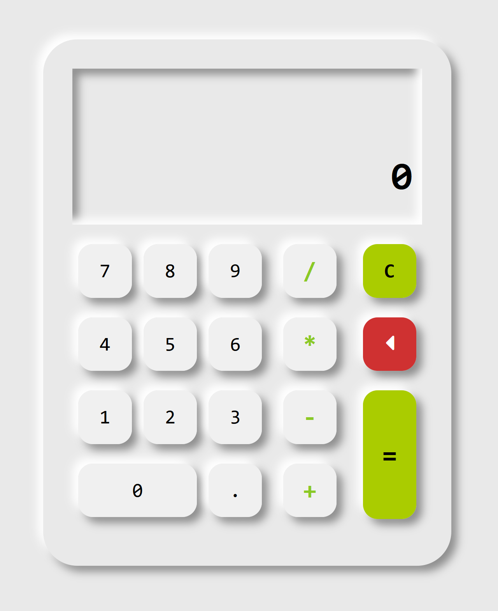

# Simple Calculator

This is a mini-project I created during my study time.
If you like this simple app, please give me a star on Github and a heart on Codepen! :grin:

## Technology used

This app is built with

1. **HTML5**
2. **Sass**
3. **Javascript ES6**

## Screenshot

 

## Usage

The calculator is functional both with mouse click and keyboard.

## Demo

Check out my [Codepen](https://codepen.io/vincentle/full/KKNvwVR) link for a live demo :grin:.

## License

This project is licensed under the terms of the [MIT](/LICENSE) license.\
MIT © [Vincent Le]("https://www.vincentle.me/").
